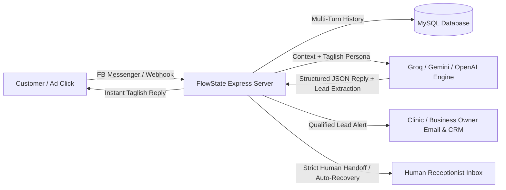
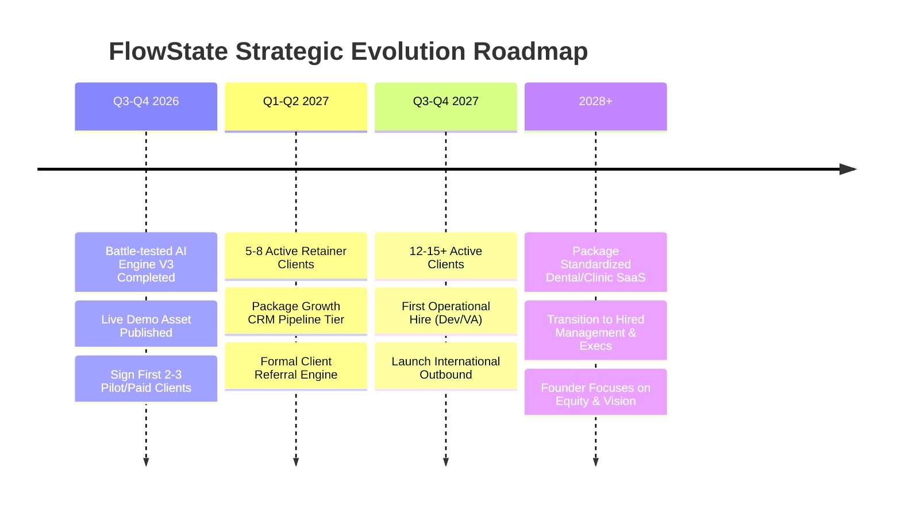

# FlowState Automations — Business Plan (Version 3.0)

**Document Version:** 3.0  
**Effective Date:** August 2026  
**Founder:** Hisham Muctar  
**Business Model:** AI & Workflow Automation Agency $\rightarrow$ Vertical SaaS (B2B)  
**Target Market:** Small-to-Medium Businesses (SMBs) in the Philippines & International English-Speaking Markets  

---

## 1. Executive Summary

### Business Overview
**FlowState Automations** is an AI-powered business automation agency that helps small and medium-sized businesses (SMBs) eliminate repetitive administrative and customer communication tasks, accelerate lead conversion, and optimize internal operations through custom conversational AI agents and workflow automation systems.

Unlike traditional no-code chatbot agencies that rely on rigid decision-tree buttons and expensive third-party SaaS per-contact fees (e.g., ManyChat), FlowState delivers **proprietary, custom-coded conversational AI engines** built on ultra-low latency LLMs (Groq Llama 3.3 70B, Google Gemini, and OpenAI GPT-4o-mini). These agents understand natural conversational language (including multilingual and Taglish phrasing), qualify leads in real-time, maintain multi-turn conversational context in dedicated databases, execute smart human handoffs, and integrate directly with client CRMs and notification pipelines.

### Long-Term Vision & Founder Objective
FlowState follows a two-stage evolution:
1. **Stage 1 (Agency / Custom Implementation):** Provide done-for-you AI agents, customer support bots, and workflow pipelines for SMBs to generate rapid cash flow, validate customer pain points, and build battle-tested systems.
2. **Stage 2 (Vertical SaaS & Productization):** Package the most recurring, high-ROI automation solutions into standardized, high-margin software products.
3. **Founder North Star:** Build FlowState into a self-sustaining, professionally managed IT and automation enterprise operated day-to-day by hired executive leadership and technical staff, while the founder retains primary equity ownership and strategic direction.

### Near-Term Milestones (Q3 2026 – Q4 2027)
* **Q3–Q4 2026:** Secure the first 2–3 paying clients leveraging FlowState’s battle-tested live AI lead conversion engine; establish foundational cash flow and local market case studies.
* **Q1–Q2 2027:** Expand to 5–8 active recurring maintenance clients (MRR: ₱25,000–₱40,000); introduce automated CRM pipelines and formal referral incentives.
* **Q3–Q4 2027:** Scale to 12–15+ active clients; hire the first junior automation engineer / VA; initiate international outbound outreach.
* **2028+:** Launch first vertical SaaS product based on the proven dental/clinic appointment engine; transition to executive-led operations.

---

## 2. Vision, Mission & Core Values

### Vision
To become a leading international business automation and AI software firm, empowering businesses across Southeast Asia and global markets to operate at peak efficiency through intelligent software and autonomous workflow systems.

### Mission
To liberate business owners and their teams from repetitive manual tasks by building reliable, high-converting AI automation systems that deliver undeniable, measurable financial return.

### Core Values
1. **Reliability First:** Systems must work without failure. Clients entrust FlowState with their customer-facing communication and revenue pipelines.
2. **Engineering Excellence:** We build robust, custom-engineered backends—not fragile, generic no-code templates that break under load.
3. **Radical Integrity:** Transparent pricing, honest scoping, strict data privacy, and realistic ROI expectations.
4. **Speed to Value:** Delivering production-ready, revenue-generating automated systems in days, not months.

---

## 3. Problem & Market Opportunity

### The Problem for SMBs
Small and medium businesses face critical operational bottlenecks:
* **The "Speed-to-Lead" Crisis:** Studies show that responding to an online inquiry within 5 minutes increases conversion rates by **391%**. However, SMB owners and receptionists frequently take hours—or days—to respond to Facebook/Instagram DMs and web chats, losing qualified buyers to competitors.
* **Repetitive DM Overwhelm:** 70% to 80% of incoming customer messages are repetitive inquiries (pricing ranges, location, operating hours, basic availability). Staff waste hours manually typing the same answers instead of closing high-ticket deals.
* **The Failure of Traditional Chatbots:** First-generation chatbots rely on rigid "click-button" trees (ManyChat, Chatfuel). When real customers type nuanced questions, Taglish phrasing, or specific inquiries, these bots break, frustrating users and driving away business.
* **High Recurring Software Costs:** Traditional no-code tools charge aggressive monthly fees based on subscriber list size, penalizing growing businesses with expensive monthly overhead.

### The FlowState Opportunity
FlowState bridges the gap with a **done-for-you, custom-coded AI automation architecture**:
* **Natural Conversational Taglish & Multilingual AI:** Powered by modern LLMs that understand nuances, intent, and colloquial phrasing.
* **Instant Structured Data Extraction:** Automatically parses patient/customer names, mobile numbers, requested procedures, and appointment preferences directly into client databases without clumsy multi-step forms.
* **Zero Subscriber-Tier Penalties:** Clients own their backend code and database, freeing them from escalating platform subscription costs.

---

## 4. Target Market & Ideal Client Profile (ICP)

FlowState positions itself as a **Broad SMB Automation Agency**, serving high-inquiry businesses with established customer demand.

### Ideal Client Profile (ICP)
| Attribute | Ideal Client Characteristic |
| :--- | :--- |
| **Business Stage** | Established, operating 1+ years with proven revenue (not pre-revenue startups). |
| **Inbound Volume** | Generates 15–50+ incoming direct messages / leads per day across Facebook, Instagram, or Web. |
| **Marketing Activity** | Actively running (or planning to run) Meta Ads (Facebook/Instagram Lead Ads). |
| **Operational Pain** | Owner or front-desk staff manually answering repetitive DMs and missing leads after office hours. |
| **Ticket Size** | Medium to high average customer transaction value (₱2,000 to ₱50,000+). |
| **Decision Maker** | Business Owner, Managing Director, or Marketing Head who prioritizes ROI over vanity tech. |

### Key Target Industry Verticals
1. **Healthcare & Specialty Clinics (Flagship Beachhead):** Dental clinics, aesthetic and dermatology centers, eye clinics, veterinary practices. *(High inquiry volume, immediate appointment booking ROI, high patient lifetime value).*
2. **Professional & Local Services:** Law firms, accounting/bookkeeping agencies, real estate developers/brokerages, automotive detailing, repair services.
3. **High-Ticket Retail & E-Commerce:** Custom furniture, bespoke apparel, specialized equipment providers requiring consultative sales conversations.

---

## 5. Products, Services & Technical Moat

### Core Flagship Offer: FlowState AI Lead Engine (v3 Architecture)
FlowState's flagship solution is a custom-coded, enterprise-grade AI conversational engine designed for Facebook Messenger, Instagram DM, WhatsApp, and Web Chat.

### Key Technical Capabilities & Moat
* **Triple AI Provider Redundancy:** Dynamically switchable between **Groq Llama 3.3 70B** (sub-second ultra-fast inference, free/low-cost high volume), **Google Gemini 3.6 Flash**, and **OpenAI GPT-4o-mini**.
* **High-Converting Conversational Taglish Persona ("Mae"):** Built-in conversational empathy, polite Filipino honorifics (*po/opo*), pricing range guidance, and promotional consultation incentives.
* **Dual AI + Regex Lead Extraction:** Indestructible dual-layer extraction that parses Philippine mobile numbers (`09XX-XXX-XXXX`, `+639...`) and customer names even if LLMs omit structured JSON fields.
* **High-Threshold Human Handoff & Auto-Recovery:** Eliminates false alarms. Casual inquiries ("are you an AI?", "who is the doctor?") are handled autonomously. The bot only pages human staff on explicit live agent demands, formal disputes, or medical emergencies—and auto-resumes after 15 minutes of staff inactivity or when the customer asks a new question.
* **Meta Ads Speed-to-Lead Integration:** Captures Meta Ad referral data (`ad_id`, `ad_title`) to attribute closed revenue directly to marketing campaigns.
* **Built-in Meta Live Compliance:** Integrated HTML `/privacy-policy` and `/data-deletion` endpoints satisfying Meta App Verification out-of-the-box.

### Service Progression Roadmap
* **Phase 1 (Flagship):** Conversational AI Lead Capture & Speed-to-Lead Engines.
* **Phase 2 (Expansion):** CRM Integrations (HubSpot, Google Sheets, Notion), Automated SMS/Email Reminders, and Multi-Channel Pipelines (WhatsApp, Web).
* **Phase 3 (Enterprise):** Custom internal operations dashboards, staff productivity bots, and AI voice appointment agents.
* **Phase 4 (SaaS Productization):** Standardized self-serve clinic appointment SaaS platform.

---

## 6. Business Model & Pricing Strategy

FlowState utilizes an accessible, low-friction agency pricing model designed for fast client acquisition, sustainable cash flow, and predictable recurring maintenance revenue.

### Service Packages & Pricing Table
| Package Tier | One-Time Setup Fee | Monthly Retainer / Maintenance | Core Inclusions |
| :--- | :--- | :--- | :--- |
| **Starter AI Lead Bot** | **₱15,000 – ₱30,000** ($300 – $600 USD) | **₱2,500 – ₱5,000 / mo** ($50 – $100 USD) | • Custom conversational AI agent on Facebook Messenger / Web • Custom persona & business knowledge base • Real-time lead qualification (Name, Phone, Service, Schedule) • MySQL database setup & multi-turn history • Instant email/dashboard lead notifications • Monthly prompt tuning & server maintenance |
| **Growth AI + CRM Pipeline** | **₱40,000 – ₱80,000** ($800 – $1,500 USD) | **₱5,000 – ₱10,000 / mo** ($100 – $200 USD) | • Everything in Starter • Multi-channel support (Messenger + Instagram / WhatsApp) • Automated CRM sync (Google Sheets / Notion / HubSpot) • Meta Ads conversion tracking & ad attribution • Automated appointment reminder email/SMS triggers • Priority technical support & weekly performance review |
| **Custom / Enterprise** | **₱100,000+** (Quote-based) | **₱15,000+ / mo** | • Custom API integrations & legacy software sync • Multi-location branch routing • Custom internal business analytics dashboard • Dedicated server architecture & SLA guarantees |

### Revenue Split Terms
* **50% Upfront Deposit:** Upon project kickoff and scope agreement.
* **50% Final Payment:** Upon staging deployment, user acceptance testing (UAT), and production go-live.

---

## 7. Go-To-Market (GTM) & Sales Strategy

### Sales Asset Arsenal
1. **Battle-Tested Live Interactive Demo:** A fully operational clinic demo page allowing prospective business owners to test the bot live from their phone, experiencing the sub-second Taglish AI replies firsthand.
2. **One-Page ROI Sales Sheet:** Illustrating the financial math: *A dental clinic spending ₱15k on Meta Ads that recovers just 2 lost high-ticket patients (₱35k braces) pays for the entire FlowState system in week one.*
3. **3-Minute Loom Video Walkthrough:** Demonstrating incoming lead capture, instant email notification, and database tracking.

### Outreach Channels
* **Channel 1 (Warm Network & Direct Local Outreach):** In-person and DM outreach to local clinic owners, dentists, aesthetic clinic managers, and professional service providers in Metro Manila and regional hubs.
* **Channel 2 (Value-First "Audit & Demo"):** Audit prospective businesses' Facebook Pages. If they have slow response times (> 1 hour) or broken ManyChat bots, send a personalized video showing FlowState's live solution handling their exact services.
* **Channel 3 (Agency & Marketing Partnerships):** Partner with local digital marketing and Meta Ads media buyers who need automated backends to convert the traffic they generate for their clients.
* **Channel 4 (International Outbound - Phase 2):** Leverage Upwork, LinkedIn outreach, and cold email targeting US, Australian, and UK SMBs seeking cost-effective custom automation.

---

## 8. Financial Projections & Unit Economics

### Monthly Operating Overhead (Lean Solo-Founder Model)
| Expense Category | Monthly Cost (PHP) | Notes |
| :--- | :--- | :--- |
| **Cloud Hosting & DB (Railway / VPS)** | ₱600 – ₱1,500 | Scalable cloud deployment |
| **AI LLM API Tokens (Groq / Gemini / OpenAI)** | ₱500 – ₱1,500 | Extremely low cost per 1M tokens |
| **Domain, Workspace & Email** | ₱500 – ₱1,000 | Professional business infrastructure |
| **Software & Dev Tools** | ₱1,000 – ₱2,000 | GitHub, tunneling, testing tools |
| **Total Monthly Overhead** | **₱2,600 – ₱6,000** | **Break-even achieved with just 1–2 maintenance clients!** |

### Year 1 Financial Scenarios (Ending Q4 2027)
| Scenario | Active Maintenance Clients | Monthly Recurring Revenue (MRR) | Cumulative Setup Revenue | Projected Annual Gross Revenue |
| :--- | :--- | :--- | :--- | :--- |
| **Conservative** | 5 clients | ₱15,000 – ₱25,000 / mo | ₱100,000 | ₱280,000 – ₱400,000 |
| **Moderate (Target)** | 10 clients | ₱35,000 – ₱50,000 / mo | ₱250,000 | ₱650,000 – ₱850,000 |
| **Optimistic** | 18+ clients | ₱75,000 – ₱120,000 / mo | ₱500,000+ | ₱1,400,000 – ₱1,900,000+ |

---

## 9. Realigned Implementation Roadmap (Q3 2026 – 2028+)

### Detailed Quarterly Milestones
* **Q3–Q4 2026 (Foundation & First 3 Clients):**
  * Finalize live portfolio demo and sales collateral.
  * Conduct targeted outreach to 30–50 high-inquiry local businesses.
  * Sign 2–3 paying implementation clients at ₱15k–₱30k setup.
  * Gather comprehensive case studies, lead conversion metrics, and video testimonials.
* **Q1–Q2 2027 (Traction & Retainer Growth):**
  * Expand client base to 5–8 active maintenance accounts.
  * Standardize deployment templates for rapid 48-hour client onboarding.
  * Introduce CRM and automated SMS reminder add-ons (Growth Package).
* **Q3–Q4 2027 (Scale & First Hire):**
  * Reach 12–15+ active clients with predictable monthly cash flow.
  * Hire a junior full-stack developer / technical virtual assistant to handle routine bot maintenance and onboarding.
  * Initiate outbound marketing to international English-speaking SMBs (US/UK/Australia).
* **2028+ (SaaS Productization & Enterprise Freedom):**
  * Convert the standardized clinic appointment bot into a multi-tenant cloud SaaS product.
  * Appoint an Operations Manager / General Manager to run daily agency operations.
  * Founder shifts focus to high-level strategy, product architecture, and enterprise expansion.

---

## 10. Risk Analysis & Mitigation Matrix

| Potential Risk | Severity | Mitigation Strategy |
| :--- | :--- | :--- |
| **Meta Platform / API Policy Changes** | Medium | Maintain core business logic and AI prompts in an engine-agnostic Node.js backend; easily portable to WhatsApp, Web Chat, and Telegram with zero architectural rework. |
| **Local SMB Price Sensitivity** | Medium | Offer low-friction entry pricing (₱15k setup) and emphasize clear ROI: show how converting just 1–2 high-ticket clients pays for the entire bot. |
| **Solo Founder Bandwidth Bottleneck** | High | Systematize all client onboarding with reusable code templates, automated DB scripts, and hire the first technical VA once MRR crosses ₱35,000. |
| **AI Hallucinations / Medical Liability** | High | Strict system prompt guardrails: the AI is explicitly barred from diagnosing or prescribing, provides pricing as ranges only, and emphasizes physical doctor exams. |

---

## 11. Conclusion & Founder Commitment

FlowState Automations is positioned at the intersection of practical SMB demand and cutting-edge artificial intelligence. By rejecting rigid no-code templates in favor of proprietary, custom-engineered AI architectures, FlowState provides unmatched conversion power for clients while building a defensible, high-margin asset for its founder.

With the core technology fully built, battle-tested, and live, the immediate priority is aggressive execution: delivering immense value to the first cohort of clients and scaling toward an enduring, self-sustaining enterprise.
